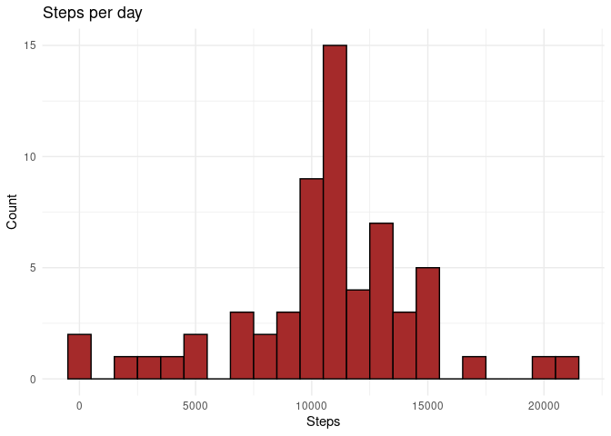
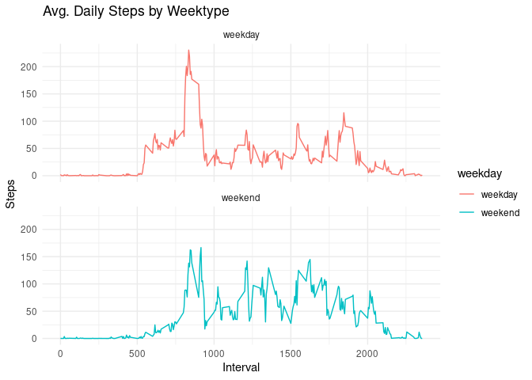

Introduction
------------

It is now possible to collect a large amount of data about personal
movement using activity monitoring devices such as a
[Fitbit](https://www.fitbit.com/it/home), [Nike
Fuelband](http://www.nike.com/us/en_us/c/nikeplus-fuelband), or [Jawbone
Up](https://jawbone.com/up). These type of devices are part of the
“quantified self” movement – a group of enthusiasts who take
measurements about themselves regularly to improve their health, to find
patterns in their behavior, or because they are tech geeks. But these
data remain under-utilized both because the raw data are hard to obtain
and there is a lack of statistical methods and software for processing
and interpreting the data.

This assignment makes use of data from a personal activity monitoring
device. This device collects data at 5 minute intervals through out the
day. The data consists of two months of data from an anonymous
individual collected during the months of October and November, 2012 and
include the number of steps taken in 5 minute intervals each day.

The data for this assignment can be downloaded from the course web site:

-   Dataset: [Activity monitoring
    data](https://d396qusza40orc.cloudfront.net/repdata%2Fdata%2Factivity.zip)
    \[52K\]

The variables included in this dataset are:

-   **steps**: Number of steps taking in a 5-minute interval (missing
    values are coded as NA);
-   **date**: The date on which the measurement was taken in YYYY-MM-DD
    format;
-   **interval**: Identifier for the 5-minute interval in which
    measurement was taken.

The dataset is stored in a comma-separated-value (CSV) file and there
are a total of 17,568 observations in this dataset.

Loading and preprocessing of the data
-------------------------------------

As first step, data needs fetching and unzipping.

    url <- 'https://d396qusza40orc.cloudfront.net/repdata%2Fdata%2Factivity.zip'
    download.file(url, './activity.zip', method = 'curl')
    unzip('./activity.zip')

At this point, data is downloaded and ready for reading.

    library(data.table)
    data <- data.table(read.csv('./activity.csv'))

What is the mean total number of steps taken per day?
-----------------------------------------------------

To answer this question, **NAs will be ignored** and an auxiliary data
frame will be computed; this new dataframe:

-   picks all the observations;
-   sums the number of steps;
-   groups the results by date.

<!-- -->

    stepsDT <- data[, lapply(.SD, sum), .SDcol = 'steps', by = .(date)]
    head(stepsDT)

    ##          date steps
    ## 1: 2012-10-01    NA
    ## 2: 2012-10-02   126
    ## 3: 2012-10-03 11352
    ## 4: 2012-10-04 12116
    ## 5: 2012-10-05 13294
    ## 6: 2012-10-06 15420

*Remark: the operation below **is only allowed on data.table class**,
which is why I had to read the file in that format. *

Follows an histogram:

    library(ggplot2)
    g <- ggplot(stepsDT, aes(x = steps))
    g + geom_histogram(color='black', fill='brown', binwidth = 1000) + labs(x='Steps',y='Count',title='Steps per day') + theme_minimal()

    ## Warning: Removed 8 rows containing non-finite values (stat_bin).

Calculating the mean and the median:

    stepsDT[,.(stepsMean = mean(steps, na.rm = TRUE), stepsMedian = median(steps, na.rm = TRUE))]

    ##    stepsMean stepsMedian
    ## 1:  10766.19       10765

\#\#What is the average daily activity pattern? First I will make a time
series plot of the 5-minutes interval (x-axis) vs. the average number of
steps taken(y axis:

    intervalDT <- data[, lapply(.SD, mean, na.rm = TRUE), .SDcol = 'steps', by = .(interval)]
    g <- ggplot(intervalDT, aes(x = interval, y = steps))
    g + geom_line(color='brown') + labs(title = 'Avg. Daily Steps', x = '5-min Interval', y = 'Avg') + theme_minimal()

The 5-minute interval which contains the maximum number of steps on
average is:

    intervalDT[steps == max(steps), .(max_interval = interval), .(avg_step = steps)]

    ##    avg_step max_interval
    ## 1: 206.1698          835

Imputing missing values
-----------------------

The total number of rows with NAs is:

    data[is.na(steps), .N] # Selecting rows with NAs and generating a col with the counting

    ## [1] 2304

In absence of better ideas, NAs will be filled with the median:

    data[is.na(steps), 'steps'] <- data[, lapply(.SD, median, na.rm = TRUE), .SDcols = 'steps']

A new dataset can be created from the last operation:

    fwrite(data, file = './TidyActivity.csv')

The same calculations and plots as before can be now made:

    stepsDT <- data[, lapply(.SD, sum), .SDcol = 'steps', by = .(date)]
    stepsDT[,.(stepsMean = mean(steps, na.rm = TRUE), stepsMedian = median(steps, na.rm = TRUE))]

    ##    stepsMean stepsMedian
    ## 1:   9354.23       10395

    g <- ggplot(stepsDT, aes(x = steps))
    g + geom_histogram(color='black', fill='brown', binwidth = 1000) + labs(x='Steps',y='Count',title='Steps per day') + theme_minimal()

<table>
<thead>
<tr class="header">
<th>Type of Estimate</th>
<th>Mean Steps</th>
<th>Median Steps</th>
</tr>
</thead>
<tbody>
<tr class="odd">
<td>With NAs</td>
<td>10765</td>
<td>10765</td>
</tr>
<tr class="even">
<td>NAs filled with Median</td>
<td>9354.23</td>
<td>10395</td>
</tr>
</tbody>
</table>

Are there differences in activity patterns between weekdays and weekends?
-------------------------------------------------------------------------

First let’s distinguish between weekdays and weekends:

    data$date <- as.Date(data$date)
    data[, `Day of Week` := weekdays(x = date)]
    data[grepl(pattern = 'Monday|Tuesday|Wednesday|Thursday|Friday', x = `Day of Week`), 'weekday'] <- 'weekday'
    data[grepl(pattern = 'Saturday|Sunday', x = `Day of Week`), 'weekday'] <- 'weekend'
    data[,`weekday` := as.factor(`weekday`)]

Follows a comparison between weekdays and weekends:

    intervalDT <- data[, lapply(.SD, mean, na.rm = TRUE),  .SDcols = 'steps', by = .(interval, `weekday`)]
    g <- ggplot(intervalDT, aes(x = interval, y = steps, color=`weekday`))
    g + geom_line() + labs(title = 'Avg. Daily Steps by Weektype', x = 'Interval', y = 'Steps') + facet_wrap(.~`weekday`, ncol = 1, nrow = 2) + theme_minimal()

